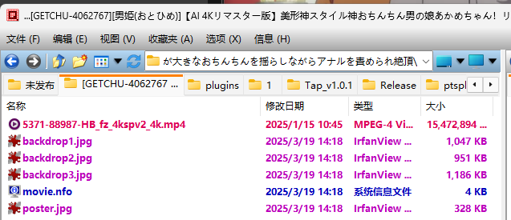

# 食用方法
把代码中的文件位置替换成你需要刮削的文件夹位置，getchu跟zidong需要你有metatube，你可以本地部署或者用别人的  
直接 `python getchu.py` 或者别的脚本名称，他就会开始刮削了，如果商品名太长导致资料夹名称过长会自动截断后面，文件名过长不处理  
ps. 截断会直接截断220以后的，lib会自动截断240，怕别的啥乱七八糟的也会截断，干脆直接自我阉割多点了…… [参考](https://github.com/arvidn/libtorrent/blob/RC_1_2/src/torrent_info.cpp#L267)

# 建议
建议硬链接文件后再跑脚本，跑完后把挂好的移动到媒体库资料夹，不要留在原位，我没做记录啥的，只要东西在资料夹里他都会刮  
如果你是拿去发种就无所谓，不会改文件名称还有别的啥，就改外面的资料夹名称，刮错了你就删了下载的图跟nfo重新刮或者别的啥……

# 效果
## GETCHU
自动把资料夹内，名为itemXXXX或者\[GETCHU-XXXX\]的东西刮削，如果商品下架也会下载图片，并且生成的nfo文件会在有视频文件的文件夹内

## GYUTTO
自动把资料夹内，名为itemXXXX或者\[GYUTTO-XXXX\]的东西刮削，如果商品下架也会下载图片，并且生成的nfo文件会在有视频文件的文件夹内

## zidong（自动）
自动把资料夹内的文件刮削，这是直接调metatube的，所以如果你里面放的东西是itemXXXX GYUTTO-XXXX大概率这些资料夹会出问题

# metatube部署参考
https://metatube-community.github.io/README_ZH/

# 刮削完效果大概这样

